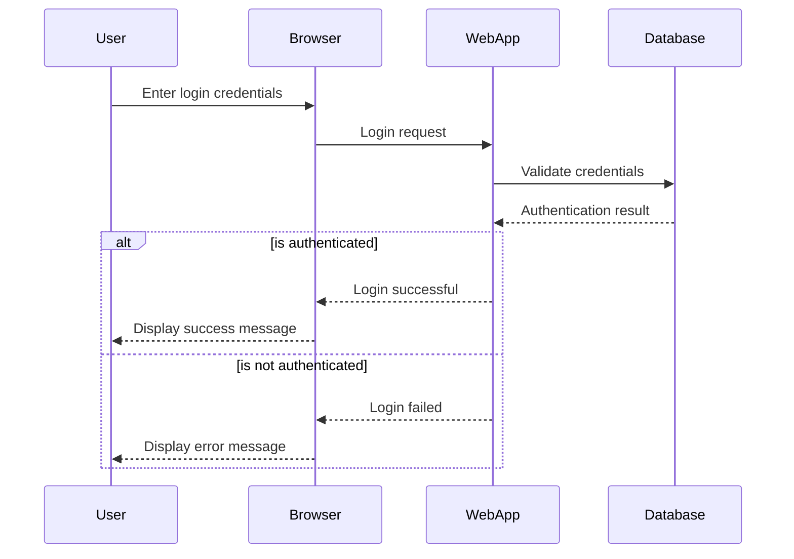

## Diagrams

### Login Flow

```mermaid
sequenceDiagram
    participant User
    participant Browser
    participant WebApp
    participant Database

    User->>Browser: Enter login credentials
    Browser->>WebApp: Login request
    WebApp->>Database: Validate credentials
    Database-->>WebApp: Authentication result
    alt is authenticated
        WebApp-->>Browser: Login successful
        Browser-->>User: Display success message
    else is not authenticated
        WebApp-->>Browser: Login failed
        Browser-->>User: Display error message
    end
```